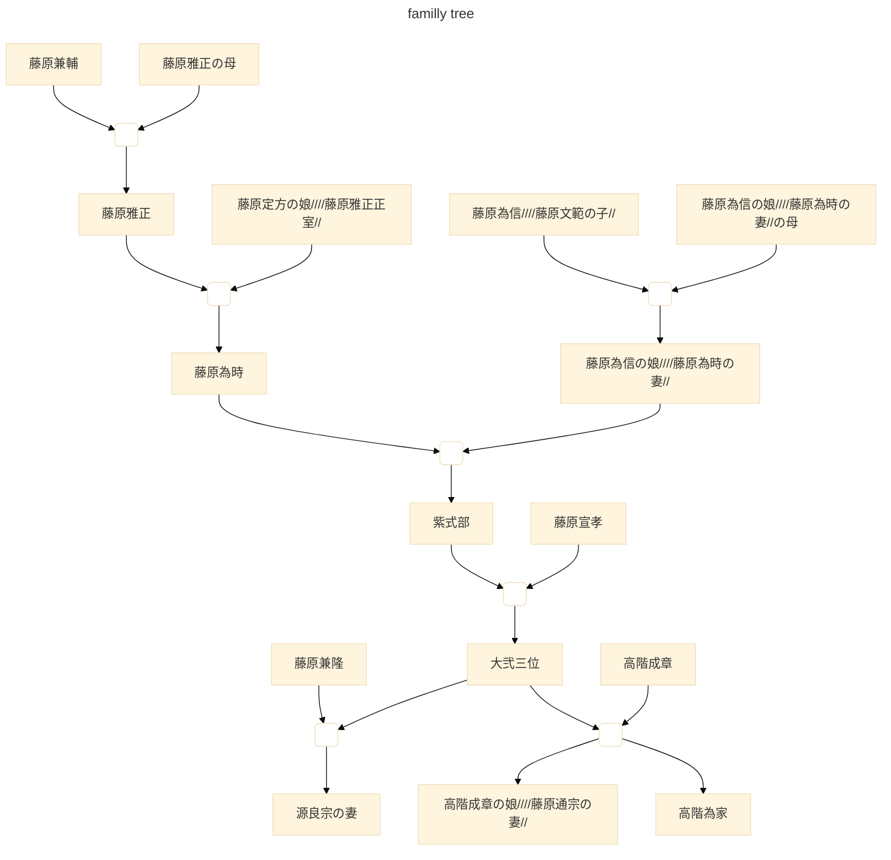
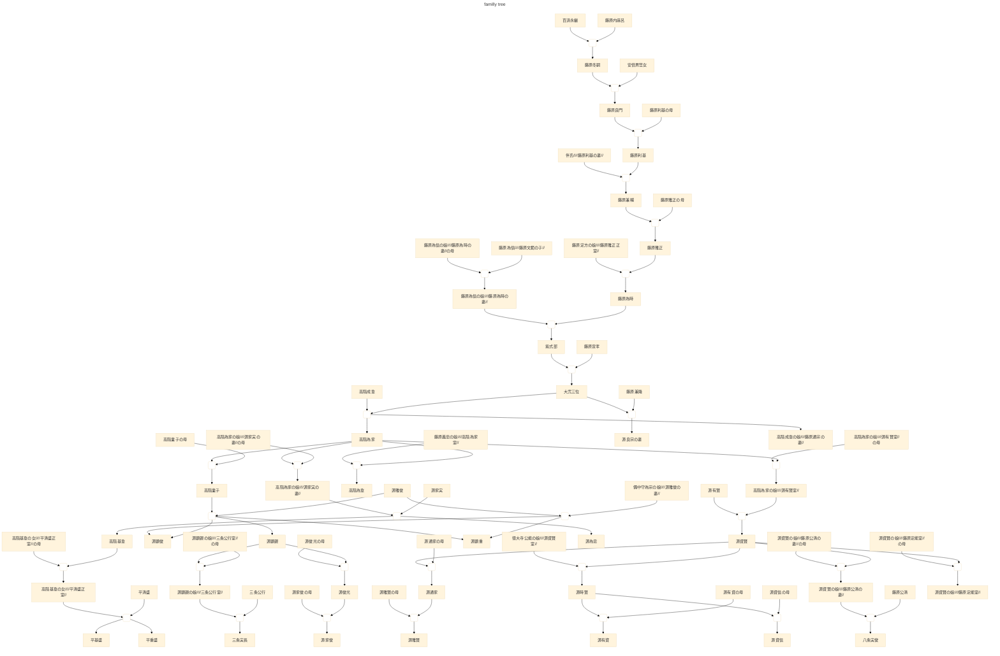

# # wikidata から家系図

- 紫式部 https://www.wikidata.org/wiki/Q81731 の子孫

## Label付きのjson
https://query.wikidata.org/sparql?query=SELECT%20DISTINCT%20%3Fhuman%20%3Ffather%20%3Fmother%20%3Fsex%20%3FhumanLabel%20%3FfatherLabel%20%3FmotherLabel%0AWHERE%0A%7B%0A%7Bwd%3AQ81731%20wdt%3AP40%2a%20%3Fhuman%20.%0A%20%20%20%20%3Fhuman%20wdt%3AP31%20wd%3AQ5%20.%20%20%20%20%20%20%0A%20%20%20%20OPTIONAL%7B%3Fhuman%20wdt%3AP22%20%3Ffather%20.%7D%0A%20%20%20%20OPTIONAL%7B%3Fhuman%20wdt%3AP25%20%3Fmother%20.%7D%0A%20%20%20%20OPTIONAL%7B%3Fhuman%20wdt%3AP21%20%3Fsex%20.%7D%0A%7D%0AUNION%0A%7B%0Awd%3AQ81731%20wdt%3AP22%2B%20%3Fhuman%20.%0A%20%20%20%20%3Fhuman%20wdt%3AP31%20wd%3AQ5%20.%20%20%20%20%20%20%0A%20%20%20%20OPTIONAL%7B%3Fhuman%20wdt%3AP22%20%3Ffather%20.%7D%0A%20%20%20%20OPTIONAL%7B%3Fhuman%20wdt%3AP25%20%3Fmother%20.%7D%0A%20%20%20%20OPTIONAL%7B%3Fhuman%20wdt%3AP21%20%3Fsex%20.%7D%0A%7D%0AUNION%0A%7B%0Awd%3AQ81731%20wdt%3AP25%2B%20%3Fhuman%20.%0A%20%20%20%20%3Fhuman%20wdt%3AP31%20wd%3AQ5%20.%20%20%20%20%20%20%0A%20%20%20%20OPTIONAL%7B%3Fhuman%20wdt%3AP22%20%3Ffather%20.%7D%0A%20%20%20%20OPTIONAL%7B%3Fhuman%20wdt%3AP25%20%3Fmother%20.%7D%0A%20%20%20%20OPTIONAL%7B%3Fhuman%20wdt%3AP21%20%3Fsex%20.%7D%0A%7D%0ASERVICE%20wikibase%3Alabel%20%7B%20bd%3AserviceParam%20wikibase%3Alanguage%20%22%5BAUTO_LANGUAGE%5D%2Cja%22%20%7D%0A%7D&format=json

